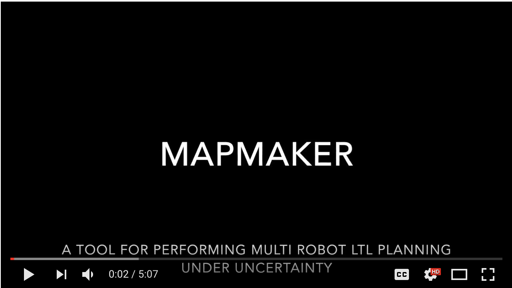

# MAPmAKER: A Tool for Performing Multi-Robot LTL Planning Under Uncertainty
MAPmAKER is a planning solution that 
- it is based on a decentralized algorithm  
- considers complex high-level missions given in temporal logic
- works when only partial knowledge of the environment is available. 

# Authors
- Claudio Menghi - claudio.menghi@gu.se
- Sergio García - sergio.garcia@gu.se
- Patrizio Pelliccione - patrizio.pelliccione@cse.gu.se

# MAPmAKER organization

- Videos of the performed experiments. Folder ./ResultsPaper contains all the videos related with our evaluation and specifically with RQ1. 
These videos are grouped in two folder containing the two examples.
Each of these folder contains a video for each ID for each step. For example, there two videos named “movie_1_Step1” and “movie_1_Step2” refer to the configuration marked with ID 1.
- Videos of the running example
- The source code of the tool in the folder MAPMAKER
- A replication package that allows to replicate the experiment

# Replicate an experiment
- Enter the folder MAPMAKER

- The `mapmaker_exp.m`  function allows launching the experiments. The function takes 3 arguments as input: `location`, `example`, and `experiment`. First of all, `location` indicates the directory that MAPmaKER needs to look for. For instance, we provide the directories RQ1, RQ2, and RunningExample used for the evaluation of our first publication.  `example` indicates the scenario to be reproduced. For instance, RQ1 and RQ2 where evaluated in two different scenarios. Finally, `experiment` indicate which experiment to be reproduced in a certain scenario (different experiments may consist on different initial positions of the robots, number of robots, different partial environment).

- To replicate the data presented in the Table 1 we should execute the following command in the Matlab's command window:

`mapmaker_exp('Example1', 'Experiment1', 'RQ1')`

- Here we can change some parts of the command in order to perform different experiments. For example, if we want to change the map of the environment the example must be changed. In that case, we can opt between Example1 or Example2. Then, the previous command should be changed to:

`mapmaker_exp('Example2', 'Experiment1', 'RQ1')`

- Not only the map can be changed but also the research question experiment or the experiment to be performed (we have experiments from 1 to 3, but more experiments can be performed and stored in these paths). 

- For creating new models we added a series of scripts that are stored in ./MAPmaKER/Evaluation/RQx/Exampley/Experimentz/RandomModelGenerator. New maps can be created customising the script Environment.m. But the fastest way of creating new models is just calling to the randomModelGenerator function. Its form is the following:

- function [Models] =randomModelGenerator(numberOfInitialConfigurations, numberOfPartialInfoConfigurations, displayEnabled)

- Here we can specify the number of initial configurations for the robot and the number of different partial configurations of the environment. If we want the experiment to be displayed, the variable displayEnabled must be set to 1.

# Publications

Menghi, C., Garcia, S., Pelliccione, P., & Tumova, J. (2018, July). Multi-robot LTL planning under uncertainty. In International Symposium on Formal Methods (pp. 399-417). Springer, Cham.

Menghi, C., García, S., Pelliccione, P., & Tumova, J. (2018, May). Towards multi-robot applications planning under uncertainty. In Proceedings of the 40th International Conference on Software Engineering: Companion Proceeedings (pp. 438-439). ACM.

